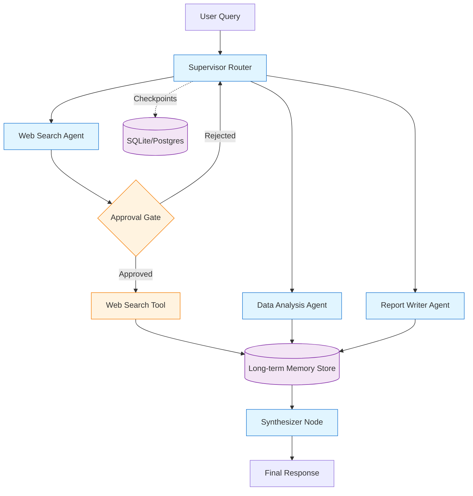

# Capstone Project: Research Assistant Agent

Build a production-ready multi-agent research assistant over the course of the workshop.

## Overview

The Research Assistant Agent is a multi-turn, multi-agent system that helps users research topics by:
- Routing queries to appropriate specialist agents
- Searching the web and retrieving information
- Performing calculations and data analysis
- Maintaining user preferences across conversations
- Requiring human approval for expensive operations
- Providing transparent, debuggable execution traces

## Learning Progression

### Day 1: Basic Workflow
- State schema with messages
- Router node that classifies queries
- Stub implementations for 3 specialist agents
- ✅ **Checkpoint**: Graph routes correctly to appropriate agent

### Day 2: Add Persistence
- SQLite checkpointer for thread persistence
- Multi-turn conversation support
- State accumulation across turns
- ✅ **Checkpoint**: Context maintained across multiple queries

### Day 3: Human-in-the-Loop
- Approval gate before web searches
- Review/edit search queries
- Stream updates with interrupt detection
- ✅ **Checkpoint**: User can approve/modify operations

### Day 4: Memory & Multi-Agent
- Long-term memory store for user preferences
- 3 fully implemented specialist agents:
  - Web Search Agent
  - Data Analysis Agent  
  - Report Writer Agent
- Supervisor routing with LLM-based decision making
- ✅ **Checkpoint**: Multi-agent system with shared memory

### Day 5: Production-Ready
- Evaluation suite (5+ test cases)
- LangSmith tracing integration
- Safety measures (rate limiting, input validation)
- Operational runbook
- ✅ **Checkpoint**: Demo-ready with passing tests

## System Architecture



## State Schema

### Python

```python
from typing import TypedDict, Annotated, Literal
from operator import add

class AgentState(TypedDict):
    # Message history
    messages: Annotated[list[dict], add]
    
    # User context
    user_id: str
    
    # Routing
    current_agent: Literal["web_search", "data_analysis", "report_writer", "none"]
    
    # Intermediate results
    search_results: list[dict]
    analysis_output: str
    
    # Final output
    final_response: str
    
    # Metadata
    iteration_count: int
```

### TypeScript

```typescript
import { StateSchema, ReducedValue } from "@langchain/langgraph";
import { z } from "zod";

const AgentState = new StateSchema({
  messages: new ReducedValue(
    z.array(z.record(z.any())).default([]),
    {
      inputSchema: z.array(z.record(z.any())),
      reducer: (x, y) => x.concat(y),
    }
  ),
  userId: z.string(),
  currentAgent: z.enum(["web_search", "data_analysis", "report_writer", "none"]),
  searchResults: z.array(z.record(z.any())).default([]),
  analysisOutput: z.string().default(""),
  finalResponse: z.string().default(""),
  iterationCount: z.number().default(0),
});
```

## Node Specifications

### 1. Supervisor Router

**Responsibility**: Classify user query and route to appropriate specialist

**Inputs**: `messages`, `user_id`  
**Outputs**: `current_agent`

**Logic**:
```python
def supervisor_router(state: AgentState) -> dict:
    """Use LLM to determine which specialist to call."""
    model = ChatOpenAI(model="gpt-4o-mini")
    
    prompt = f"""
    Given this user query, determine which specialist should handle it:
    - web_search: For factual questions, current events, or research
    - data_analysis: For calculations, data processing, or analysis
    - report_writer: For summarization, documentation, or writing
    
    Query: {state["messages"][-1]["content"]}
    
    Return ONLY one of: web_search, data_analysis, report_writer
    """
    
    response = model.invoke([{"role": "user", "content": prompt}])
    agent = response.content.strip().lower()
    
    return {"current_agent": agent}
```

### 2. Web Search Agent

**Responsibility**: Search the web and return relevant results

**Inputs**: `messages`, `user_id`  
**Outputs**: `search_results`, `messages`

**Tools**: 
- `tavily_search` (or similar web search API)
- Requires approval via `interrupt()` before executing

**Logic**:
```python
from langgraph.types import interrupt

def web_search_agent(state: AgentState, *, store) -> dict:
    """Search web with approval gate."""
    query = state["messages"][-1]["content"]
    
    # Check user preferences
    namespace = (state["user_id"], "preferences")
    prefs = list(store.search(namespace))
    prefer_academic = any("academic" in p.value.get("source_preference", "") for p in prefs)
    
    # Approval gate
    approved = interrupt({
        "action": "web_search",
        "query": query,
        "will_use_academic": prefer_academic,
        "message": "Approve this web search?"
    })
    
    if not approved:
        return {"messages": [{"role": "assistant", "content": "Search cancelled."}]}
    
    # Execute search
    results = tavily_search.invoke(query)
    
    return {
        "search_results": results,
        "messages": [{"role": "assistant", "content": f"Found {len(results)} results"}]
    }
```

### 3. Data Analysis Agent

**Responsibility**: Perform calculations and analyze data

**Inputs**: `messages`, `search_results`  
**Outputs**: `analysis_output`, `messages`

**Tools**:
- Python interpreter (via LangChain)
- Calculator

**Logic**:
```python
def data_analysis_agent(state: AgentState) -> dict:
    """Analyze data or perform calculations."""
    model = ChatOpenAI(model="gpt-4o-mini")
    
    # Use Python REPL tool for complex analysis
    tools = [PythonREPLTool()]
    agent_executor = create_react_agent(model, tools)
    
    result = agent_executor.invoke({"messages": state["messages"]})
    
    return {
        "analysis_output": result["messages"][-1].content,
        "messages": [result["messages"][-1]]
    }
```

### 4. Report Writer Agent

**Responsibility**: Synthesize information into coherent response

**Inputs**: `messages`, `search_results`, `analysis_output`  
**Outputs**: `final_response`, `messages`

**Logic**:
```python
def report_writer_agent(state: AgentState, *, store) -> dict:
    """Write final report."""
    model = ChatOpenAI(model="gpt-4o-mini")
    
    # Gather context
    search_context = "\n".join([r.get("content", "") for r in state["search_results"]])
    analysis_context = state["analysis_output"]
    
    # Get user writing preferences
    namespace = (state["user_id"], "preferences")
    prefs = list(store.search(namespace))
    tone = "formal"
    for p in prefs:
        if "tone" in p.value:
            tone = p.value["tone"]
    
    prompt = f"""
    Write a comprehensive response using this information:
    
    Search Results:
    {search_context}
    
    Analysis:
    {analysis_context}
    
    Style: {tone}
    
    Original Query: {state["messages"][0]["content"]}
    """
    
    response = model.invoke([{"role": "user", "content": prompt}])
    
    return {
        "final_response": response.content,
        "messages": [{"role": "assistant", "content": response.content}]
    }
```

## Required Features

### ✅ Persistence
- [ ] Uses SQLite or Postgres checkpointer
- [ ] Supports multi-turn conversations
- [ ] Can resume after interrupts
- [ ] Handles node failures gracefully

### ✅ Human-in-the-Loop
- [ ] At least one approval gate (web search)
- [ ] Ability to edit search queries before execution
- [ ] Streaming with interrupt detection
- [ ] Clear user prompts for decisions

### ✅ Memory
- [ ] Long-term store for user preferences
- [ ] Preferences persist across threads
- [ ] At least 2 types of preferences (e.g., source preference, writing tone)
- [ ] Memory influences agent behavior

### ✅ Multi-Agent
- [ ] 3 specialist agents implemented
- [ ] Supervisor routing logic
- [ ] Agents can collaborate (share state)
- [ ] Modular design (subgraphs optional)

### ✅ Evaluation
- [ ] Dataset with 5+ test cases
- [ ] At least 2 evaluators (programmatic + LLM-judge)
- [ ] Tests pass in CI/CD
- [ ] LangSmith traces captured

### ✅ Safety
- [ ] Input validation (length, content)
- [ ] Tool allowlist
- [ ] Rate limiting (optional)
- [ ] Error handling with user-friendly messages

## Evaluation Rubric

### Functionality (25 points)
- Graph executes without errors (10)
- All agents produce reasonable outputs (10)
- Routing logic is correct (5)

### Persistence (15 points)
- Multi-turn conversations work (7)
- State correctly accumulates (5)
- Checkpoint recovery works (3)

### HITL (15 points)
- Interrupt gates implemented (7)
- User can approve/reject (5)
- Streaming detection works (3)

### Memory (15 points)
- Store correctly configured (5)
- Preferences persist across threads (7)
- Preferences influence behavior (3)

### Evaluation (10 points)
- Dataset created (3)
- Evaluators implemented (4)
- Tests run successfully (3)

### Safety (10 points)
- Input validation (4)
- Error handling (3)
- Tool allowlist (3)

### Code Quality (10 points)
- Clean, readable code (4)
- Documented (docstrings, comments) (3)
- Follows patterns from workshop (3)

**Total: 100 points**  
**Minimum to Pass: 60 points**

## Example Scenarios

### Scenario 1: Research with Memory
```
User (Thread 1): "I prefer academic sources"
Agent: [Stores preference]

User (Thread 2): "Research quantum computing"
Agent: "I'll search academic sources. Approve?" [INTERRUPT]
User: "Yes"
Agent: [Searches academic databases]
Agent: "Here's a summary of quantum computing from peer-reviewed sources..."
```

### Scenario 2: Multi-Agent Collaboration
```
User: "Analyze the population growth of cities over 1M people"
Router: → Data Analysis Agent
Data Agent: "I need population data first"
Router: → Web Search Agent
Web Agent: "Search for city population data?" [INTERRUPT]
User: "Yes"
Web Agent: [Returns data]
Router: → Data Analysis Agent
Data Agent: [Analyzes and calculates trends]
Router: → Report Writer
Writer: "Population trends show..."
```

### Scenario 3: Error Recovery
```
User: "Search for XYZ topic"
Web Agent: [Searches but API fails]
Agent: "Search failed. Should I retry?" [INTERRUPT]
User: "Yes"
Web Agent: [Retries successfully]
```

## Implementation Timeline

### Day 1 (Foundation)
- [ ] Define state schema
- [ ] Create router stub
- [ ] Add 3 agent stubs
- [ ] Basic graph structure

### Day 2 (Persistence)
- [ ] Add SQLite checkpointer
- [ ] Test multi-turn conversations
- [ ] Implement state accumulation

### Day 3 (HITL)
- [ ] Add approval gate in web agent
- [ ] Implement query editing
- [ ] Build streaming loop

### Day 4 (Memory & Multi-Agent)
- [ ] Add memory store
- [ ] Implement preference storage/retrieval
- [ ] Fully implement all 3 agents
- [ ] Add LLM-based routing

### Day 5 (Production)
- [ ] Create evaluation dataset
- [ ] Write evaluators
- [ ] Add safety measures
- [ ] Prepare demo

## Deliverables

### Code
- `graph.py` (or `graph.ts`): Main graph definition
- `agents/`: Individual agent implementations
- `tools/`: Tool definitions
- `config.py`: Configuration and constants
- `requirements.txt` or `package.json`: Dependencies

### Tests
- `tests/test_routing.py`: Routing logic tests
- `tests/test_persistence.py`: Multi-turn tests
- `tests/test_memory.py`: Cross-thread memory tests
- `tests/test_evaluation.py`: Evaluation harness

### Documentation
- `README.md`: Setup and usage instructions
- `ARCHITECTURE.md`: System design decisions
- `RUNBOOK.md`: Operational procedures

### Demo
- Recorded 5-minute demo video OR
- Live demo during capstone presentations

## Getting Started

```bash
# Python
cd capstone/python
python -m venv .venv
source .venv/bin/activate
pip install -r requirements.txt
cp .env.example .env
# Edit .env with your keys
python graph.py

# TypeScript
cd capstone/typescript
npm install
cp .env.example .env
# Edit .env with your keys
npm run start
```

## Support

- Instructors available during lab time
- Helper rotation for debugging
- Slack/Discord channel for questions
- Office hours: 12:00-13:00 daily

## Submission

Not required for the workshop, but encouraged:
- Push to your own GitHub repository
- Share on LinkedIn/Twitter with #LangGraph
- Add to your portfolio

**Good luck! Build something amazing! 🚀**
